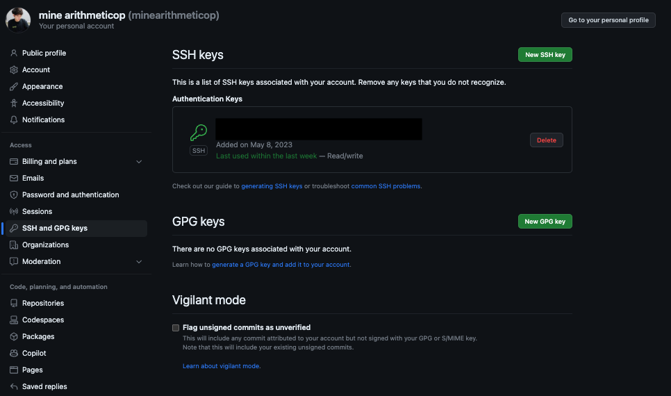
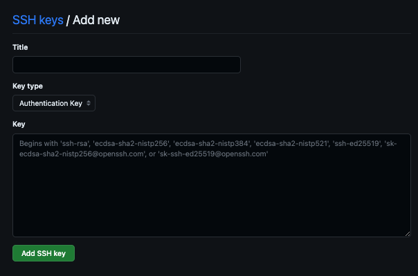

# Guide To Setup Github With SSH
Guide to setup github when use multiple git account (can use with github/gitlab)

## Procedure

### 1. Gen ssh key
```bash
ssh-keygen -t rsa -b 4096 -C "your_email@example.com"
```

### 2. Enter name for ssh key
```
Generating public/private rsa key pair.
Enter file in which to save the key (/Users/me/.ssh/id_rsa): <name>
Enter passphrase (empty for no passphrase):
Enter same passphrase again:
Your identification has been saved in <name>
Your public key has been saved in <name>.pub
The key fingerprint is:
SHA256:xxxxxxxxxxxxxxxxxxxxxxxxxxxxxx your_email@example.com
The key's randomart image is:
+---[RSA 4096]----+
|                 |
|                 |
|                 |
|                 |
|                 |
|                 |
|                 |
|                 |
|                 |
+----[SHA256]-----+
```

### 3. Set config file
```note
cd .ssh
nano/code config
```

```
#Setup Github
Host <name> github.com
HostName github.com
User git
IdentityFile /.ssh/<name>
PreferredAuthentications publickey
IdentitiesOnly yes

#Setup Gitlab
Host <name2> gitlab.com
HostName gitlab.com
User git
IdentityFile /.ssh/<name2>
PreferredAuthentications publickey
IdentitiesOnly yes
```

### 4. Setup key on github

  #### 4.1 Enter to this link https://github.com/settings/keys

   

  #### 4.2 Click New SSH key
  
   

  #### 4.3 Enter Title and copy data in <name>.pub from .ssh
   

  #### 4.4 Use cat <name>.pub
    ssh-rsa xxxxxx your_email@example.com <- copy this

  #### 4.5 Click Add SSH key
